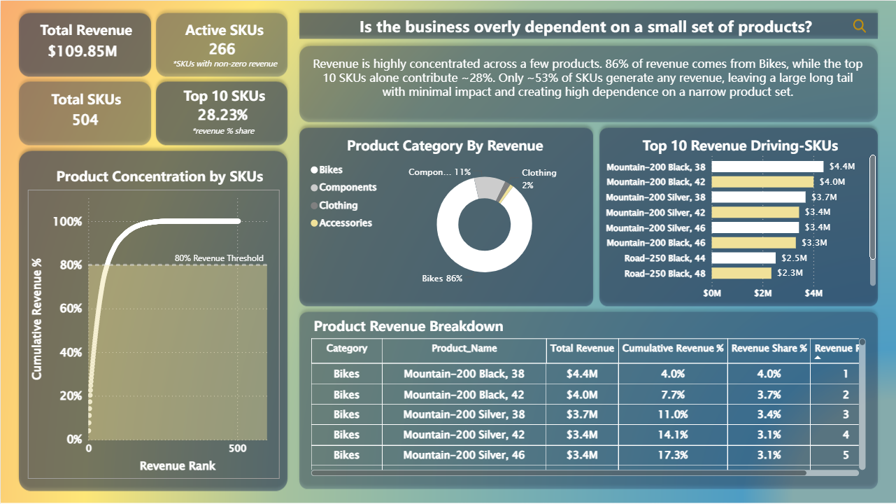
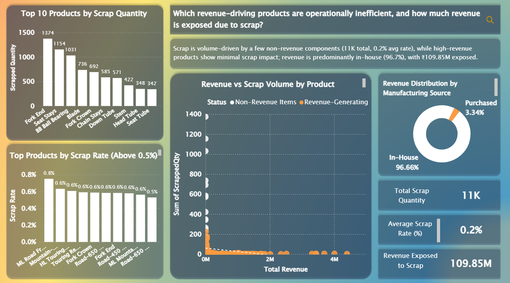
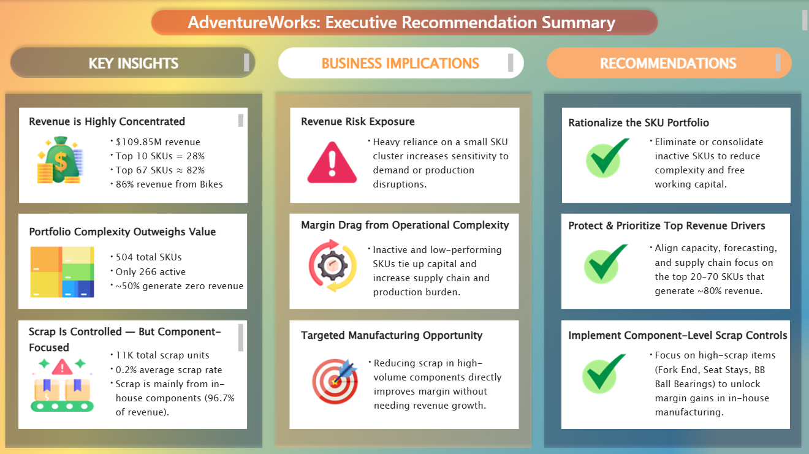

AdventureWorks2022: Revenue & Operations Analysis 🚲💰

Executive-ready analysis of AdventureWorks2022.
Each report is structured as a Triptych: Scatter → Donut → Bar to reduce cognitive friction and concentrate attention on where decisions matter most.

Raw ERP tables were transformed into curated SQL views, then modeled in Power BI for executive-level insight delivery.

📝 TL;DR Dashboard

Revenue: $109.85M

Active SKUs: 266 / 504

Revenue Concentration: Top 10 SKUs = 28%

Revenue Concentration: Top 67 SKUs ≈ 82%

Scrap Exposure: 11K units

Average Scrap Rate: 0.2%

Primary Exposure: In-house components

Strategic Priority: Rationalize SKU portfolio, protect revenue drivers, reduce operational drag.

📌 Report 1: Revenue Concentration & Product Dependency

Visual Structure

Scatter Plot: Revenue by SKU → exposes concentration curve

Donut Chart: Revenue by Category → validates category dominance

Bar Chart: Top Revenue SKUs → isolates economic drivers

Insight

67 SKUs generate ~82% of total revenue.
Bikes alone contribute ~86% of category revenue.

Revenue is concentrated. Portfolio breadth does not equal value.

Actions
1️⃣ Focus on Top 20–70 SKUs

So What: Releasing operational bandwidth from the bottom ~400 SKUs avoids the complexity thicket that erodes margins.

2️⃣ Monitor Category Dependency (Bikes)

So What: Reduces exposure to single-category shocks.

3️⃣ Rationalize Low-Performing SKUs

So What: Frees capital, simplifies forecasting, reduces inventory drag.

📌 Report 2: Operational Efficiency & Scrap Exposure

Visual Structure

Bar Graph: Top scrap quantities → operational culprits

Scatter Plot: Revenue vs Scrap → prioritize economic impact

Donut Chart: Manufacturing Source → in-house dominance

Insight

Overall scrap rate is low (0.2%) but concentrated in high-volume in-house components.

Waste is small in percentage terms, but not in absolute operational leverage.

Actions
1️⃣ Implement Component-Level Scrap Controls

So What: Margin improvement without increasing sales.

2️⃣ Prioritize Fork End, Seat Stays, BB Ball Bearings

So What: Targeting a few high-impact components maximizes operational ROI.

3️⃣ Reduce Margin Drag from Complexity

So What: Simplifies production flows and frees capacity.

📌 Report 3: Executive Recommendations & Strategic Implications

Rationalize SKU Portfolio

Eliminate inactive or low-performing SKUs
So What: Simplifies operations, frees working capital, reduces supply chain friction

Protect & Prioritize Revenue Drivers

Focus on 20–70 SKUs (~80% revenue)
So What: Concentrates management attention on economic value

Implement Scrap Controls

Reduce operational waste
So What: Unlocks margin gains without revenue expansion

Align Capacity & Forecasting

Support high-revenue SKUs efficiently
So What: Reduces stockouts, idle capacity, and volatility

🗂️ Data Architecture (SQL Backbone)

All analysis is powered by curated SQL views created in SSMS.

Database context:

USE AdventureWorks2022;
Base Tables Used

Production.Product

Production.ProductCategory

Production.ProductSubcategory

Sales.SalesOrderDetail

Sales.SalesOrderHeader

Production.WorkOrder

Production.BillOfMaterials

Final Analytical Views
🔹 vw_ProductMaster

Decision Focus: Product classification, lifecycle, manufacturing status.

LEFT JOIN preserves all products

Identifies category hierarchy

Tracks sell start/end/discontinued status

🔹 vw_Sales_Fact

Decision Focus: Revenue and time intelligence.

INNER JOIN ensures revenue accuracy

Enables Year / Quarter / Month slicing

Forms revenue concentration analysis layer

🔹 vw_Production_WorkOrders

Decision Focus: Manufacturing efficiency and scrap exposure.

OrderQty vs StockedQty

ScrappedQty measurement

Batch-level production tracking

🔹 vw_ProductComplexity

Decision Focus: Assembly and component intensity.

Component count per product

Maximum BOM depth

Identifies operational complexity drivers

📁 Repository Structure
/sql/              → SQL scripts defining analytical views
/views_results/    → Exported view outputs from SSMS
/screenshots/      → Triptych visuals
AdventureWorks2022_Dataset.xlsx
README.md

Strategic Outcome

Concentrate revenue.
Reduce complexity.
Control waste.
Convert operational noise into decision leverage.

📦 Data Source & Reproducibility

This project uses the AdventureWorks2022 sample database provided by Microsoft.

The database file is not redistributed in this repository to respect licensing terms and avoid unnecessary file size expansion.

You can download the official database directly from Microsoft:

Official Download & Installation Guide:
https://learn.microsoft.com/en-us/sql/samples/adventureworks-install-configure?view=sql-server-ver17&tabs=ssms

🔧 How to Reproduce the Analysis

Download AdventureWorks2022.bak from the official Microsoft link above.

Open SQL Server Management Studio (SSMS).

Right-click Databases → Restore Database.

Select Device → Choose the downloaded .bak file.

Restore the database as AdventureWorks2022.

Execute the SQL scripts located in:

/sql/

This will recreate the analytical views used in the reports and Power BI modeling layer.